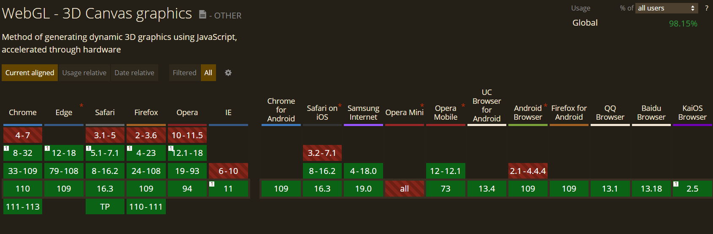

# ThreeJS

<iframe src="https://threejs.org/" height=100% loading="eager"></iframe>
<!--is a library-->
<!--often misconception that the web can only be 2d-->
<!--as this is more often than not the only thing we can see-->
<!--ThreeJS changes that-->
<!--Possible because of WebGL-->
<!--a low-level graphics API created specifically for the web.-->
<!--<iframe src="https://particle-love.com/"></iframe>-->

---

# Browser Compatibility

---
<!---->
# Use Cases
<iframe src="https://particle-love.com/" height=100% ></iframe>

---

<iframe src="https://jesse-zhou.com/"height=100% ></iframe>

---

<iframe src="https://renaultespace.littleworkshop.fr/"height=100% ></iframe>

---

# Usage

<iframe src="https://codepen.io/madyf/embed/KKBLeGd"height=100% ></iframe>

---

# References

- https://threejs.org/
- https://particle-love.com/
- https://jesse-zhou.com/
- https://helloenjoy.itch.io/hellorun
- https://renaultespace.littleworkshop.fr/